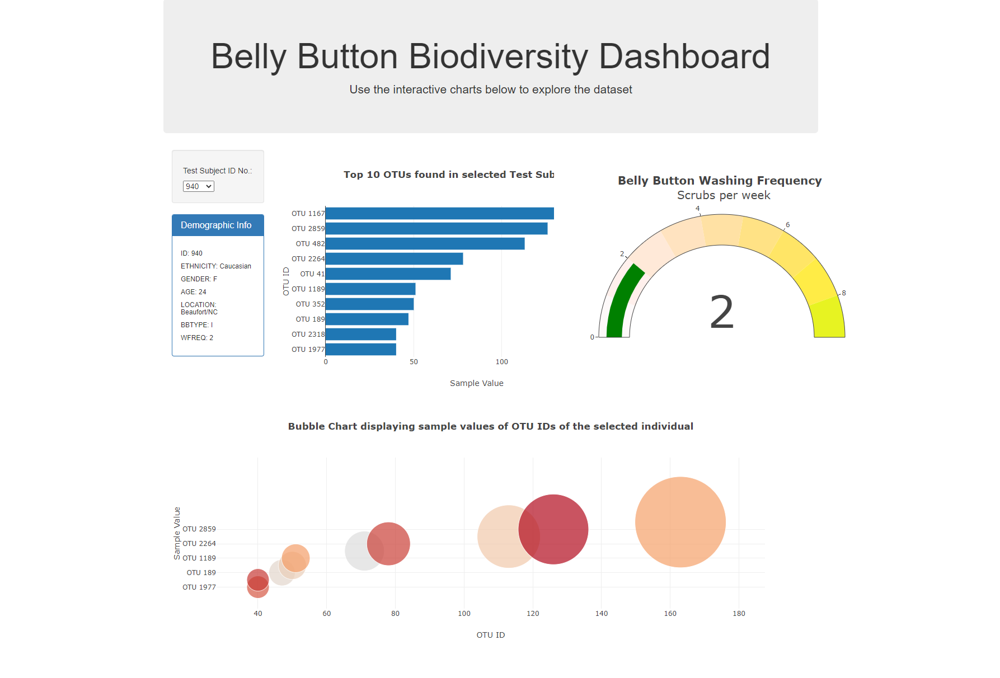

# Plotly-Belly-Button-Biodiversity

## Data
The Data(samples.json) includes information of belly-betton biodiversity from different people.

## Variables explaination 
ID: Personal ID
OTU ID: bacteria ID
Wfreq: belly button washing frequency

## Functionality
The web has a dropdown menu, from which you can select personID. 
After selecting, the panel will show the personal information.
And three plots about the top10 bacteria in his or her belly button, will be generated automatically.
  - a bar chart
  - a bubble chart 
  - a Gauge Chart
  - 
## Web Screenshoot

